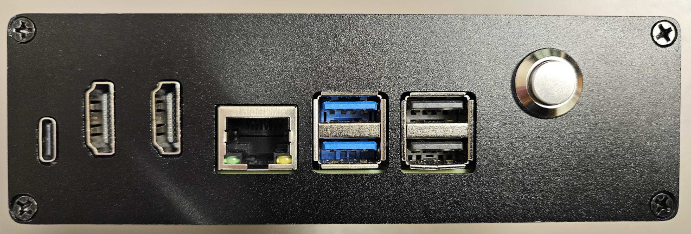
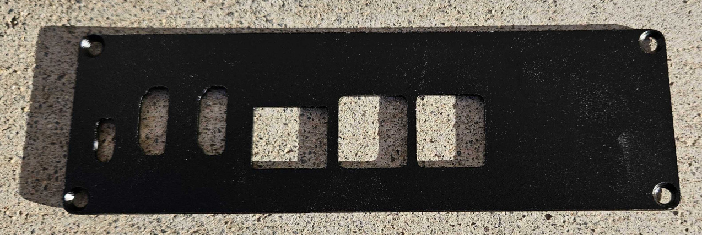
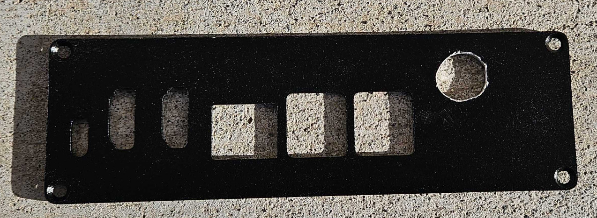
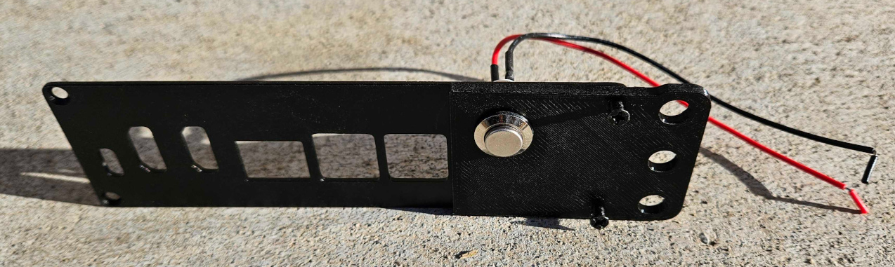
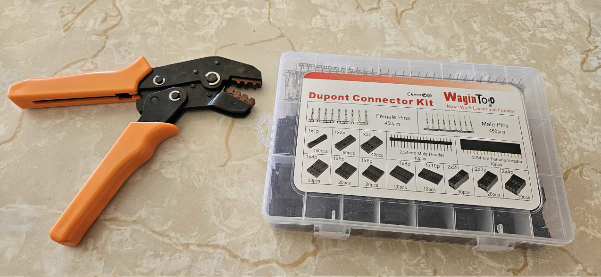
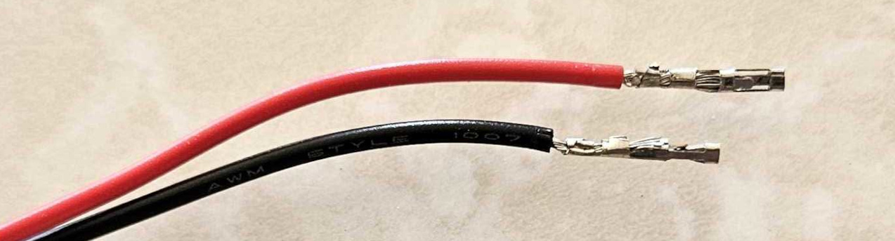
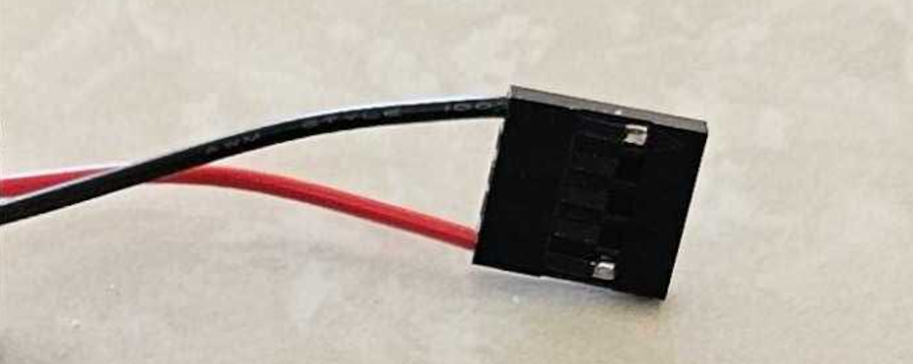

## Raspberry Pi bootloader for bootc

This project enables bootc based images to be booted on Raspberry Pi based hardware to boot bootc based OSes without needing UEFI chainloaders.

### Why

* The chainloaders don't usually have support for proper devicetree initialization on the pi's without someone self assembling single devicetree files from the overlays for specific boards making them hard to support.
* Support for the newest hardware often lags significant amounts of time. PI5's still don't have reliable support years after release.
* They also lack support for some of the special features of the firmware such as the RPI tryboot mechanism and hardware buttons on the PI header

### Usage

Run `bootc switch` or `bootc update` as normal

Tryboot:

The tryboot feature is enabled with writing `TRYBOOT=1` to `/etc/rpi-bootc-bootloader/tryboot.conf`

Switch image as normal, but without apply. When ready to apply, run `rpi-bootc-bootloader tryreboot`

This will cause the RPI to boot the currently staging bootc image on the next boot. Failure to boot or a power cycle should return it automatically to the current, working image.

Once the boot is successful and you are happy with it, run `rpi-bootc-bootloader sync` to update the default to the current image.

### Circuit

To support manually selecting the previous image to boot, we need to add a push button to the RPI header. Connect it to GPIO pin 6 (PI header pin 31), and ground, easiest is PI header pin 39. No resisters are needed.

To fall back to the previous image, simply hold in the button while booting.

### Example case

Grab a case like:
* https://www.amazon.com/dp/B0DB5WJQYC
* https://www.amazon.com/dp/B0D97VK1VW

And a 12mm button like:
* https://www.amazon.com/dp/B0BC1BF3RK

Start with the front plate:

Measure ~0.5 inches from the top and from the closest usb cutout. Drill a 12mm hole centered at that point.

Add optional mounting rail if you want to rack mount it, fit the button through the hole and secure with the nut that comes with the button:

Use a crimper and attach a Dupont 1x5 Connector

Crimp on the pins

Slip on the connector

